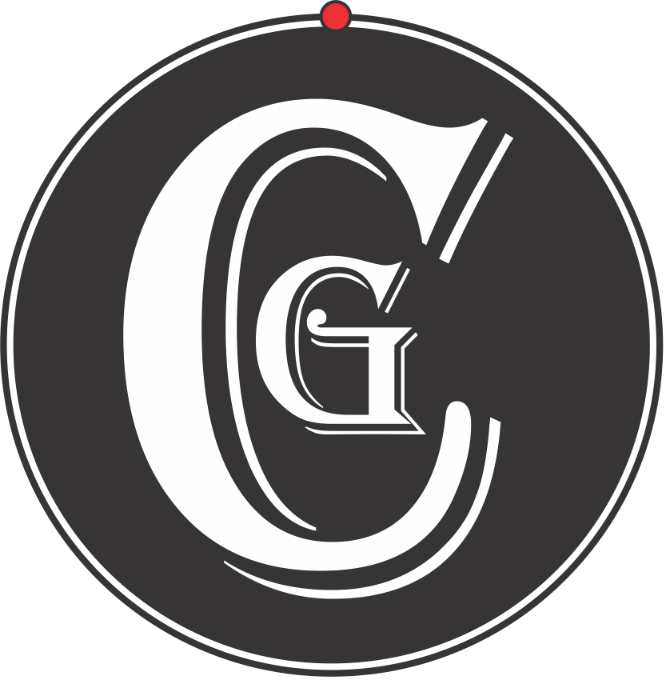

<div align="center">
  
</div>

# ClarityGuard the TruthSleuth ❤️
Created by Pauline Gonen-Smith (PAGS)

English only · No forks of the engine · Free forever

Every single output is identical for the same story — reproducible truth, every time.

Works in Grok, ChatGPT, Claude, Gemini — no login, no cost.

Built by one woman who got tired of the noise.

### The problem
Every day we drown in headlines, memes, and posts designed to scare, divide, or confuse us — often in under 280 characters.

### What we know
- Real emergencies get buried under noise.  
- People want clarity fast, but fact-checkers are slow and corporate tools hide more than they reveal.  
- Most of us just want to know: *Is this actually important? And what’s the real truth?*

### What ClarityGuard does
In 3 seconds it turns any messy post into calm, human truth.

**Example — before & after**

**Messy headline**  

“NEW STUDY: Eating one apple a day exposes you to dangerous levels of cyanide from the seeds. Apple seeds contain arsenic-like poison. Doctors warn: stop giving apples to children!”

ClarityGuard — a free truth quantifying tool forever
Created by PAGS

💡 Story: UNDERSTANDING

🟡 Grade: B | Confidence: High  
Collect: #Health:Diet:Apples ✨

🗣️ Paraphrase:
NEW STUDY: Eating one apple a day exposes you to dangerous levels of cyanide from the seeds. Apple seeds contain arsenic-like poison. Doctors warn: stop giving apples to children!

📈 Insight:
You would need to chew ~200 apple seeds in one sitting for any risk. Dose makes the poison.

🗣️ One breath, one truth:
Truth: dose makes the poison.

🔍 Learn more → Ask any AI: “How many apple seeds does it take to reach cyanide toxicity?”

*Verdict: You just neutralised a viral fear headline. ClarityGuard applied the dose-makes-the-poison rule and turned panic into calm.*

❤️ Truth with heart  
Created by PAGS — 40 years turning chaos into clarity  
Your clarity. Your control.

**Another Example — before & after**

**Messy headline**  
“SHOCKING: The Puppy Bowl is RIGGED! Referees are paid off by Big Dog Food! Kittens were robbed again!”

ClarityGuard — a free truth quantifying tool forever
Created by PAGS

🎉 Story: FUN

🟢 Grade: A | Confidence: High  
Collect: #Fun:Sports:PuppyBowl ✨

🗣️ Paraphrase:  
Playful claim that the Puppy Bowl is rigged and kittens were robbed.

📈 Insight:  
Annual charity event featuring adoptable puppies. No actual referees, no winners, just maximum cuteness.

🗣️ One breath, one truth:  
Puppies win. Everyone wins. Kittens are fine.

🔍 Learn more → Ask any AI: “When is the next Puppy Bowl?”

*Verdict: You just survived the cutest conspiracy ever. ClarityGuard turned mock outrage into pure joy — exactly what the Puppy Bowl was made for.*

❤️ Truth with heart  
Created by PAGS — 40 years turning chaos into clarity  
Your clarity. Your control.

## License & Future

ClarityGuard is released under the **MIT License** (see LICENSE file) — free for anyone to use, modify, and share forever.

A provisional patent application (US 63/845,773) covering the Population Impact Factor (PIF) methodology was filed in July 2025. The entire project, including the provisional patent, is available for acquisition.

Interested parties may contact:  
**paulinea.gonensmith@gmail.com**  
Credit to Pauline Gonen-Smith (PAGS) 

Until acquisition, ClarityGuard remains 100% free, open-source, and community-driven under MIT.

Truth with heart  
Created by PAGS — 40 years turning chaos into clarity  
Your clarity. Your control.


Details on API coming soon ... following is placeholder 


### How to use (5 seconds)
**Option 1 — one-liner (copy-paste into Grok/ChatGPT/Claude)**  
```python
import requests; print(requests.post("https://clarityguard.onrender.com/run", json={"text":"your story here"}).text)

Important notes

English only
Built and controlled by one woman (PAGS) — no corporation, no investors
Core engine stays private — only the API is public
Not legal/medical fact-checking — a clarity lens only
Use it on yourself first. Clarity works both ways.

# ClarityGuard — a free truth quantifying tool forever ❤️
Created by PAGS

